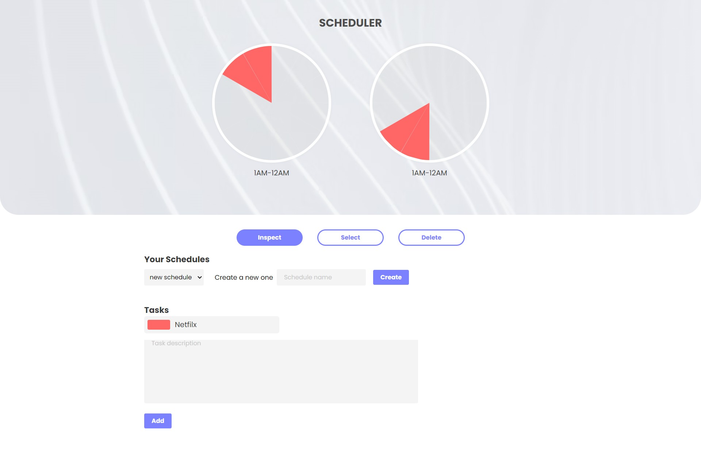
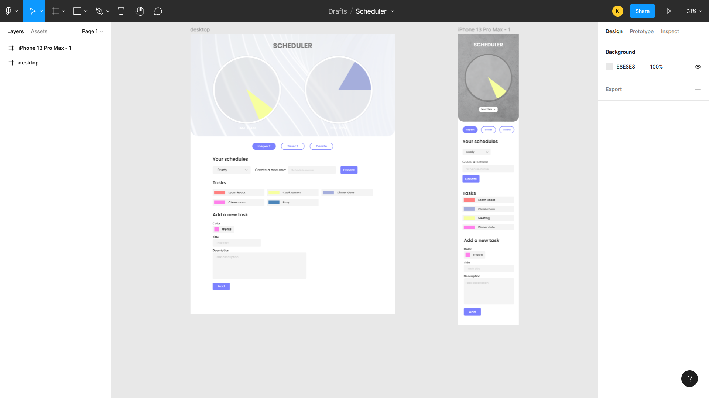

# **
Scheduler
**
**
A scheduler built to make scheduling my study easier
**
**<a href='https://scheduler-k4ung.netlify.app' align='center' style='display: block' >Live site</a>**

### **Built with**
- React
- CSS module
- Redux

### **How to use**

First you need a schedule set. The default one given is named 'new schedule' but you can just simply create a new schedule and switch to it.

And then you can start adding you tasks. You must specify the color, title and description for a task. Title and description fields are required. Colors must be unique.

There're three modes you can choose. The first one, 'Inspect' allows you to inspect your task details in task list and on the clock by simply clicking on it. You can also edit them if you want.

The second mode, 'Select' Allows you to assign your tasks to the clock. You can simply select the task you want in the task list and add it to the clock by clicking the desired part. The selected task will be highlighted with a black border.

The third one, 'Delete' allows you to unassign certain parts of the clock, remove tasks and schedule sets. You must have more than one schedule to delete one.

### **How it started**

I used to draw my schedules on a paper. One day, I got the idea to just make an app out of it so here it is, a scheduler app with circular clocks.

### **Idea**

I wanted this scheduler to be clock-based. So there will be 24 slots for a schedule, one for an hour. User should be able to add task with a title, description and a color. There're three modes to switch to. First one is Inspect which allows user to inspect what their current tasks are about(and edit them maybe). Second one is Select, where users can select one of the tasks and actually assign it to the desired hours on the clock. Lastly, the Delete mode which allows users to unassign certain parts of the clock, remove tasks completely or even one of the schedules.

### **Design process**

I wanted the design to be minimal and user-friendly so I just went with this simple, straight-to-the-point layout.

### **Coding process**

This is my first project using Redux and I can't be greateful enough for choosing Redux to do this. I couldn't imagine the state management of this app without Redux. Making the clock functional was also very challenging. I created 12 slices for both clocks, each slice with its own number which is then used to identify the position of the pieces. State management was one of the hardest I've done with React. The controls were flexible so I had to look out for every edge cases to avoid unexpected bugs and errors.

### **Some features I'm glad I added**

I almost didn't add the delete functionalities because (I was LAZY), but they turned out to be quite simple. I'm also glad that I allowed the users to have multiple schedule sets. Overall, this was an incredible challenge for me and I'm just glad that I had the idea and went for actually writing it.